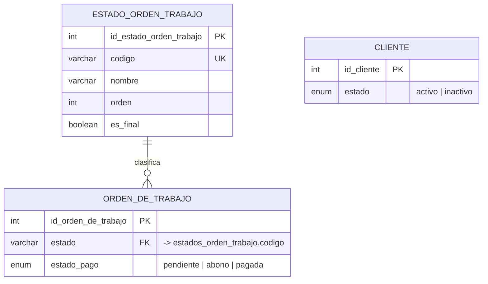

# Estandarización de estados

> Estado: propuesta aprobada · Fecha: 2026-09-24 · Alcance: BD (Prisma + MySQL), API, frontend, seed y diagrama ER
> Referencias de archivo/línea verificadas contra `main` en `d7ecde5` (PR #135). Si `main` avanzó, usen la búsqueda `rg` de cada fase como fuente de verdad.

## 1. Problema

Todos los campos `estado` del schema son `VarChar` libres, sin restricción en la BD. Cada desarrollador escribe el valor a mano, y hoy conviven variantes del mismo estado:

| Campo | Variantes encontradas en el código |
| --- | --- |
| `OrdenDeTrabajo.estado` | `"Por realizar"` / `"por realizar"`, `"En curso"` / `"en curso"`, `"Entregado"` / `"entregado"`, `"completada"`, `"activa"`, `"por entregar"` |
| `estadoPago` (OT, venta, compra) | `"pagada"`, `"Pagado"`, `"pagado"`, `"Pendiente"`, `"pendiente"`, `"PENDIENTE"`, `"abono"` |
| `estado` de Cliente, Proveedor, Usuario, Rol, Producto, Categoría, Servicio | `"activo"` / `"inactivo"` (más de 50 usos escritos a mano) |

Consecuencias:

- Una comparación `===` con distinta mayúscula falla **sin ningún error** y el flujo toma la rama equivocada. Por eso el frontend llena el código de `toLowerCase()` y de dobles comparaciones (`"pagada" || "pagado"`).
- Nadie sabe con certeza qué estados existen: la máquina de transiciones de la OT está **copiada en 4 lugares** (2 rutas API, `columns.tsx` y `OrderDetailDialog.tsx`).
- Los stored procedures filtran por literales de texto (ya pasó: un SP filtraba por un estado inexistente).
- La API acepta cualquier string como `estadoPago` desde el cliente, sin validación.

## 2. Decisión

| Qué | Solución | Por qué |
| --- | --- | --- |
| Estado de la OT | **Tabla catálogo** `estados_orden_trabajo` + FK | Es un flujo de trabajo con 6 estados, un orden y estados finales. Lo consumen los SP, y en SQL una FK es más confiable que un literal. |
| Activo/inactivo (Cliente, Proveedor, Usuario, Rol, Producto, Categoría, Servicio) | **Enum compartido** `EstadoRegistro { activo inactivo }` | El estado es binario y no va a crecer. Un `ENUM` nativo de MySQL lo restringe sin tabla extra, y los valores guardados no cambian, así que el código existente sigue compilando. |
| `estadoPago` (OT, VentaEnMostrador, OrdenDeCompra) | **Enum** `EstadoPago { pendiente abono pagada }` | Son 3 valores fijos y toca dinero. Se elige `pagada` porque es la forma que ya usa la mayor parte del código. |

**Descartado:** una única tabla `estados` compartida por todas las entidades. Es el antipatrón *One True Lookup Table*: la FK no impide que un cliente quede en estado `"En curso"`, así que no valida nada útil.

**Regla para el código:** ningún estado se escribe como string literal.
- Estados de la OT → constantes de `lib/work-order-status.ts` (el archivo ya existe; se extiende).
- `EstadoRegistro` y `EstadoPago` → el enum que genera Prisma (`import { EstadoPago } from "@/generated/prisma"`).

## 3. Plan de trabajo

Son **3 PRs independientes**, uno por fase. Cada PR incluye su migración **y** los cambios de código correspondientes, porque si se separan, `main` queda roto entre un merge y otro.

Orden recomendado: Fase 2 (la más simple) → Fase 1 → Fase 3.

---

### Fase 1 — Tabla `estados_orden_trabajo`

#### 1.1 Schema (`prisma/schema.prisma`, módulo "Ventas y Órdenes de Trabajo")

```prisma
model EstadoOrdenTrabajo {
  idEstadoOrdenTrabajo Int     @id @default(autoincrement()) @db.UnsignedInt @map("id_estado_orden_trabajo")
  codigo               String  @unique @db.VarChar(30)
  nombre               String  @db.VarChar(50)
  orden                Int     @db.UnsignedInt
  esFinal              Boolean @default(false) @map("es_final")

  ordenesDeTrabajo OrdenDeTrabajo[]

  @@map("estados_orden_trabajo")
}

model OrdenDeTrabajo {
  // ...
  estado     String  @db.VarChar(30) @map("estado")   // antes VarChar(50) libre
  // ...
  estadoOrden EstadoOrdenTrabajo @relation(fields: [estado], references: [codigo])
}
```

> **Nota de diseño:** la FK apunta a `codigo` (único) y no al id. Así la columna `estado` sigue guardando un texto legible (`'EN_CURSO'`), los `where: { estado: ... }` y los SP no necesitan JOIN, y la tabla conserva el id surrogate como el resto del schema.

#### 1.2 Datos del catálogo

| codigo | nombre | orden | esFinal |
| --- | --- | --- | --- |
| `POR_REALIZAR` | Por realizar | 1 | false |
| `EN_ESPERA` | En espera | 2 | false |
| `EN_CURSO` | En curso | 3 | false |
| `LISTO_PARA_ENTREGAR` | Listo para entregar | 4 | false |
| `ENTREGADO` | Entregado | 5 | true |
| `ANULADA` | Anulada | 6 | true |

#### 1.3 Migración

Hay que crearla con `npx prisma migrate dev --create-only --name estados_orden_trabajo` y **editar el SQL a mano** antes de aplicarla, siguiendo este orden:

```sql
-- 1. Crear el catálogo y cargar los estados
CREATE TABLE `estados_orden_trabajo` ( ... );   -- lo genera Prisma
INSERT INTO `estados_orden_trabajo` (`codigo`, `nombre`, `orden`, `es_final`) VALUES
  ('POR_REALIZAR', 'Por realizar', 1, false),
  ('EN_ESPERA', 'En espera', 2, false),
  ('EN_CURSO', 'En curso', 3, false),
  ('LISTO_PARA_ENTREGAR', 'Listo para entregar', 4, false),
  ('ENTREGADO', 'Entregado', 5, true),
  ('ANULADA', 'Anulada', 6, true);

-- 2. Normalizar los datos existentes ANTES de agregar la FK
UPDATE `ordenes_de_trabajo` SET `estado` = CASE LOWER(TRIM(`estado`))
  WHEN 'por realizar'        THEN 'POR_REALIZAR'
  WHEN 'en espera'           THEN 'EN_ESPERA'
  WHEN 'en curso'            THEN 'EN_CURSO'
  WHEN 'activa'              THEN 'EN_CURSO'
  WHEN 'listo para entregar' THEN 'LISTO_PARA_ENTREGAR'
  WHEN 'por entregar'        THEN 'LISTO_PARA_ENTREGAR'
  WHEN 'entregado'           THEN 'ENTREGADO'
  WHEN 'completada'          THEN 'ENTREGADO'
  WHEN 'anulada'             THEN 'ANULADA'
  ELSE `estado`  -- a propósito: un valor desconocido hace fallar la FK y queda a la vista
END;

-- 3. Cambiar la columna y agregar la FK
ALTER TABLE `ordenes_de_trabajo` MODIFY `estado` VARCHAR(30) NOT NULL;
ALTER TABLE `ordenes_de_trabajo` ADD CONSTRAINT ... FOREIGN KEY (`estado`)
  REFERENCES `estados_orden_trabajo`(`codigo`);   -- lo genera Prisma
```

Antes de aplicar la migración en la BD compartida (TiDB), revisen que no quede ningún valor sin mapear:

```sql
SELECT estado, COUNT(*) FROM ordenes_de_trabajo GROUP BY estado;
```

> ⚠️ No editar migraciones ya aplicadas (por ejemplo `20260913230000_add_dias_servicio...`, que usa `'Entregado'`). Los **SP nuevos** (incluido el del PR #140) deben usar los códigos: `WHERE estado = 'ENTREGADO'`.

#### 1.4 Constantes (`lib/work-order-status.ts`, archivo existente)

Hoy este archivo solo exporta `ACTIVE_WORK_ORDER_STATUSES` (lo usa `app/api/clientes/route.ts`). Se extiende para que sea la **única** definición en código de los estados y de las transiciones:

```ts
export const ESTADO_OT = {
  POR_REALIZAR: "POR_REALIZAR",
  EN_ESPERA: "EN_ESPERA",
  EN_CURSO: "EN_CURSO",
  LISTO_PARA_ENTREGAR: "LISTO_PARA_ENTREGAR",
  ENTREGADO: "ENTREGADO",
  ANULADA: "ANULADA",
} as const

export type EstadoOt = (typeof ESTADO_OT)[keyof typeof ESTADO_OT]

// ANULADA se permite desde cualquier estado no cerrado (regla especial, ya existe en las rutas)
export const TRANSICIONES_OT: Record<EstadoOt, EstadoOt[]> = {
  POR_REALIZAR: ["EN_CURSO", "EN_ESPERA"],
  EN_CURSO: ["LISTO_PARA_ENTREGAR", "EN_ESPERA"],
  EN_ESPERA: ["EN_CURSO", "LISTO_PARA_ENTREGAR"],
  LISTO_PARA_ENTREGAR: ["ENTREGADO", "EN_CURSO"],
  ENTREGADO: [],
  ANULADA: [],
}

// Se mantiene el nombre para no romper app/api/clientes/route.ts; solo cambian los valores
export const ACTIVE_WORK_ORDER_STATUSES: EstadoOt[] = [
  ESTADO_OT.POR_REALIZAR, ESTADO_OT.EN_CURSO, ESTADO_OT.EN_ESPERA, ESTADO_OT.LISTO_PARA_ENTREGAR,
]
export const ESTADOS_OT_FINALIZADOS: EstadoOt[] = [ESTADO_OT.LISTO_PARA_ENTREGAR, ESTADO_OT.ENTREGADO]
export const ESTADOS_OT_CERRADOS: EstadoOt[] = [ESTADO_OT.ENTREGADO, ESTADO_OT.ANULADA]
```

Validación con Zod v4: `z.enum(ESTADO_OT)`, en lugar de `z.string()`.

#### 1.5 Archivos a modificar

**Backend**

- [ ] `app/api/ordenes-trabajo/[idVenta]/estado/route.ts` — borrar el mapa de transiciones local (l. 9-14) e importar `TRANSICIONES_OT`; reemplazar los literales (l. 67-138)
- [ ] `app/api/punto-venta/[idPuntoVenta]/estado/route.ts` — lo mismo (l. 15-18 y 304-450)
- [ ] `app/api/ordenes-trabajo/route.ts` — zod `estadoOrden: z.string().default("Por realizar")` (l. 56), lista de estados (l. 239-244), l. 427
- [ ] `app/api/punto-venta/route.ts` — lista de estados (l. 267-272), l. 894
- [ ] `app/api/ordenes-trabajo/[idVenta]/servicios/route.ts:455`
- [ ] `app/api/ordenes-trabajo/[idVenta]/servicios/[idLinea]/route.ts:146`
- [ ] `app/api/punto-venta/[idPuntoVenta]/lineas/[idLinea]/route.ts:153-160`
- [ ] `app/api/bicycles/historial/route.ts:8` → `ESTADOS_OT_FINALIZADOS`
- [ ] `app/api/clientes/route.ts` — sin cambios si se mantiene el nombre `ACTIVE_WORK_ORDER_STATUSES`; verificar
- [ ] Las APIs que devuelven OTs deben incluir `estadoOrden: { select: { nombre: true } }` para que el frontend muestre el nombre y no el código
- [ ] Endpoint nuevo `GET /api/ordenes-trabajo/estados` (con `requirePermission`) que devuelva el catálogo ordenado por `orden`, para los `<Select>`

**Frontend** (`app/(routes)/punto-ventas/ordenes-trabajo/components/ListOrdenesTrabajo/` salvo que se indique otra ruta)

- [ ] `columns.tsx` — tercera copia de las transiciones (l. 40-43); filtros (l. 175-208); badges (l. 228-239)
- [ ] `OrderDetailDialog.tsx` — cuarta copia de las transiciones (l. 51-56); l. 132-141; badges (l. 161-172); l. 594
- [ ] `kpi-cards.tsx:16-43`
- [ ] `upcoming-deadlines.tsx:17`
- [ ] `AssignSuppliesDialog.tsx:239, 624`
- [ ] `ListOrdenesTrabajo.tsx:277, 295`
- [ ] `data-table.tsx:176-180` — valores del filtro (`"activa"`, `"completada"`, `"anulada"`)
- [ ] `app/(routes)/punto-ventas/ordenes-trabajo/components/FormCreateOrder/FormCreateOrder.tsx:482`
- [ ] `app/(routes)/bicicletas/components/ListBicicletas/BikeCard.tsx:15-17`
- [ ] `app/(routes)/bicicletas/components/ListBicicletas/ListBicicletas.tsx:86-90`
- [ ] `app/(routes)/clientes/components/ListClientes/ListClientes.tsx:453-454`
- [ ] `app/(routes)/clientes/components/ClientHistory/WorkOrderHistoryItem.tsx:11-15` — con los códigos ya no hace falta el `toLowerCase()` ni los alias (`"completada"`, `"activa"`)
- [ ] `app/(routes)/clientes/components/ClientHistory/ClientHistoryContent.tsx:138-143` — cargar las opciones desde el endpoint

> Los badges de `columns.tsx` y `OrderDetailDialog.tsx` muestran etiquetas distintas al estado (`"En curso"` → "Activa", `"Entregado"` → "Completada"). Decidan si la UI pasa a usar `nombre` del catálogo o si se mantienen esas etiquetas; lo importante es que el `case` compare contra `ESTADO_OT.*`.

**Seed**

- [ ] `prisma/seed.ts` — crear el catálogo **antes** que las OTs y usar `ESTADO_OT.*` (l. 541-610)

Para encontrar lo que se haya escapado de esta lista:

```bash
rg -n -i "\"(por realizar|en espera|en curso|listo para entregar|entregado|anulada|completada|activa|por entregar)\"" app components lib prisma/seed.ts
```

Al terminar, esa búsqueda debe devolver solo textos de UI (labels), nunca comparaciones. Ojo: `"anulada"` en minúscula también aparece en `punto-ventas/ventas/**`, pero eso es `VentaEnMostrador.estado` (fuera de alcance, ver sección 6).

> **Ojo con Prisma:** si en algún `create` de `OrdenDeTrabajo` se usa `connect` anidado (por ejemplo, `venta: { connect }`), Prisma no permite mezclarlo con el FK escalar `estado`. En ese caso hay que usar `estadoOrden: { connect: { codigo: ESTADO_OT.POR_REALIZAR } }`. `npm run typecheck` lo detecta.

---

### Fase 2 — Enum `EstadoRegistro` (activo/inactivo)

#### 2.1 Schema

```prisma
enum EstadoRegistro {
  activo
  inactivo
}
```

En **Rol, Usuario, Cliente, Proveedor, Producto, Categoria y Servicio**, reemplazar:

```prisma
estado String @db.VarChar(20)
```

por:

```prisma
estado EstadoRegistro @default(activo)
```

#### 2.2 Migración

Primero hay que comprobar que en la BD compartida no existan otros valores:

```sql
SELECT 'clientes' t, estado, COUNT(*) FROM clientes GROUP BY estado
UNION ALL SELECT 'proveedores', estado, COUNT(*) FROM proveedores GROUP BY estado
UNION ALL SELECT 'usuarios', estado, COUNT(*) FROM usuarios GROUP BY estado
UNION ALL SELECT 'roles', estado, COUNT(*) FROM roles GROUP BY estado;
-- repetir para productos, categorias y servicios
```

Luego, con `--create-only`, agregar **antes** de cada `ALTER TABLE ... MODIFY estado ENUM(...)` una línea de normalización:

```sql
UPDATE `clientes` SET `estado` = LOWER(TRIM(`estado`));
-- una línea por cada tabla
```

Sin ese paso, MySQL en modo estricto rechaza el `ALTER` si encuentra un `'Activo'` o un `'ACTIVO'`.

#### 2.3 Código

- Los literales `estado: "activo"` que ya existen **siguen compilando**, porque Prisma genera los enums como uniones de strings. No hay que tocarlos todos de una vez.
- Lo que sí hay que corregir es donde un `string` libre llega al campo (bodies de la API, zod con `z.string()`). `npm run typecheck` marca cada caso. Se resuelve validando con `z.enum(EstadoRegistro)`, importado de `@/generated/prisma`.
- En código nuevo, usar `EstadoRegistro.activo` en vez del literal.

---

### Fase 3 — Enum `EstadoPago`

#### 3.1 Schema

```prisma
enum EstadoPago {
  pendiente
  abono
  pagada
}
```

Aplicarlo a `estadoPago` en **OrdenDeTrabajo, VentaEnMostrador y OrdenDeCompra**, con `@default(pendiente)`.

#### 3.2 Migración (normalizar antes del `ALTER`)

```sql
UPDATE `ordenes_de_trabajo` SET `estado_pago` = CASE LOWER(TRIM(`estado_pago`))
  WHEN 'pagada'    THEN 'pagada'
  WHEN 'pagado'    THEN 'pagada'
  WHEN 'pendiente' THEN 'pendiente'
  WHEN 'abono'     THEN 'abono'
  WHEN 'parcial'   THEN 'abono'
  ELSE `estado_pago`
END;
-- repetir para ventas_en_mostrador y ordenes_de_compra
```

#### 3.3 Archivos a modificar

> ⚠️ No confundir con `Pago.estado`: en `punto-venta/[idPuntoVenta]/estado/route.ts` las líneas 183 y 368 escriben `estado: "pagada"` en la tabla `pagos`. Eso queda fuera de alcance.

**Backend**

- [ ] `app/api/ventas/route.ts:73` — default `"pagado"` → `EstadoPago.pagada` + validar con `z.enum(EstadoPago)`
- [ ] `app/api/punto-venta/route.ts:454` — default `"pendiente"` + validar
- [ ] `app/api/punto-venta/[idPuntoVenta]/route.ts:422, 565` — hoy guarda `String(estadoPago).trim()` sin validar
- [ ] `app/api/punto-venta/[idPuntoVenta]/estado/route.ts:133, 150, 209, 351`
- [ ] `app/api/ordenes-trabajo/route.ts:54, 422` — zod `z.string().default("pendiente")` → `z.enum(EstadoPago)`
- [ ] `app/api/ordenes-trabajo/[idVenta]/servicios/[idLinea]/route.ts:155-156`
- [ ] `app/api/ordenes-compra/route.ts:280` — `"PENDIENTE"` → `EstadoPago.pendiente`

**Frontend**

- [ ] `components/common/WorkOrderDocument.ts:17-18, 75` — eliminar la doble comparación `pagada`/`pagado`
- [ ] `app/(routes)/punto-ventas/ventas/components/FormCreateVenta/FormCreateVenta.tsx:78, 538-539`
- [ ] `app/(routes)/punto-ventas/ventas/components/ListVentas/ListVentas.tsx:126, 275, 278`
- [ ] `app/(routes)/punto-ventas/ventas/components/ListVentas/columns.tsx:22-26, 72, 168-172`
- [ ] `app/(routes)/punto-ventas/ventas/components/ListVentas/SaleDetailDialog.tsx:51, 149`
- [ ] `app/(routes)/punto-ventas/ventas/components/ListVentas/data-table.tsx:132-133`
- [ ] `app/(routes)/punto-ventas/ordenes-trabajo/components/FormCreateOrder/FormCreateOrder.tsx:77, 414, 471-475`
- [ ] `app/(routes)/punto-ventas/ordenes-trabajo/components/FormCreateOrder/PaymentInitialSection.tsx:55-90`
- [ ] `app/(routes)/punto-ventas/ordenes-trabajo/components/ListOrdenesTrabajo/ListOrdenesTrabajo.tsx:371`
- [ ] `app/(routes)/punto-ventas/ordenes-trabajo/components/ListOrdenesTrabajo/OrderDetailDialog.tsx:136-137, 366-371`
- [ ] `app/(routes)/clientes/components/ClientHistory/WorkOrderHistoryItem.tsx:21-23`

**Seed**

- [ ] `prisma/seed.ts:485, 649, 718` — `"Pagado"` / `"Pendiente"` → valores del enum

Para encontrar lo que se haya escapado:

```bash
rg -n -i "estadoPago|\"(pagada|pagado|pendiente|abono|parcial)\"" app components lib prisma/seed.ts
```

---

## 4. Diagrama ER

Cambios en el diagrama de base de datos:

- **Entidad nueva** `ESTADO_ORDEN_TRABAJO` (módulo Ventas y Órdenes de Trabajo), con relación **1:N** hacia `ORDEN_DE_TRABAJO`.
- Los enums **no son entidades**. Se anotan como dominio del atributo: `estado: ENUM(activo, inactivo)` y `estado_pago: ENUM(pendiente, abono, pagada)`.



## 5. Definition of Done (por fase)

- [ ] Migración creada con `--create-only`, con el paso de normalización, y aplicada en local sin errores
- [ ] `npx prisma generate` ejecutado
- [ ] `npm run typecheck` y `npm run lint` sin errores
- [ ] `npm run seed` corre sobre una BD limpia
- [ ] La búsqueda `rg` de la fase no devuelve comparaciones con literales
- [ ] Prueba manual del flujo afectado (Fase 1: crear OT → cambiar estado → entregar → ver tiempo de servicio; Fase 2: desactivar cliente/proveedor; Fase 3: crear venta pagada, crear OT con abono y completar el pago)
- [ ] Diagrama ER actualizado (Fase 1)
- [ ] PR revisado y aprobado por un compañero distinto del autor

## 6. Fuera de alcance (siguiente iteración, mismo patrón)

Estos campos también son `VarChar` libres. Se pueden tratar después siguiendo este mismo documento:

- `Pago.estado` (el seed usa `"Completado"` y `"Completada"`; la API escribe `"pagada"`)
- `OrdenDeCompra.estado` y `estadoRecepcion` (`"PENDIENTE"`)
- `VentaEnMostrador.estado` (`"anulada"` en la API, `"Anulada"` en otros lugares)
- `ReclamoGarantia.estado`, `DocumentoTributario.estado`
